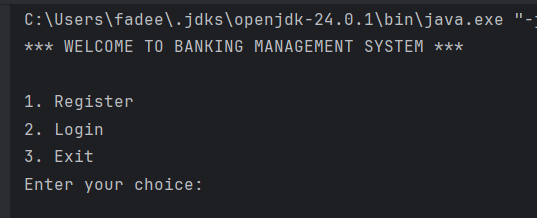
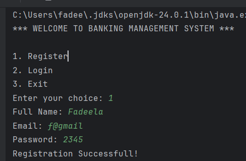
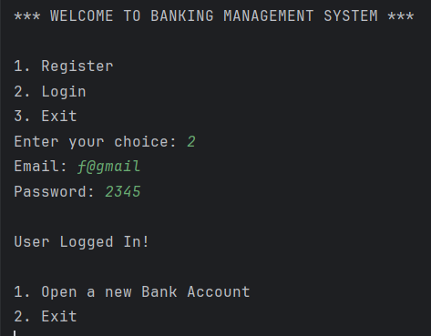
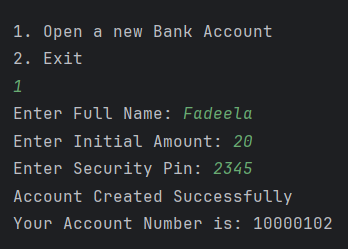
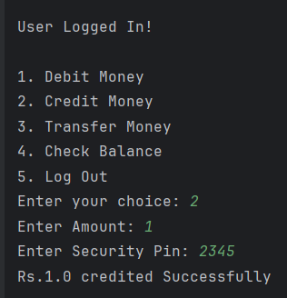
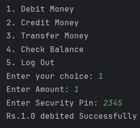
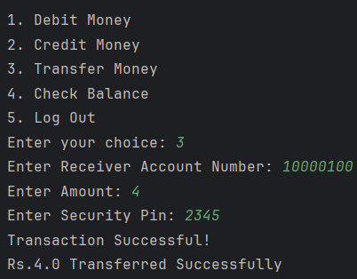
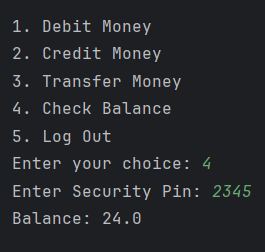
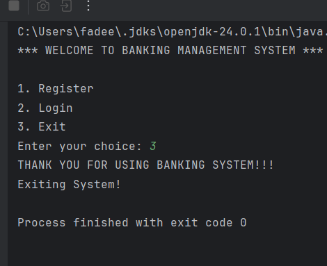

# Banking Management System

A simple (vanilla) Java-based Banking Management System that allows users to register, log in, and manage bank accounts using JDBC and MySQL. This project demonstrates basic CRUD operations, user authentication, and account management in a console-based application.

---

## Features

- **User Registration & Login**  
  Secure user registration and login system with email verification (currently plain text passwords; consider adding hashing for production use).

- **Account Management**  
  Open bank accounts with unique account numbers, check for existing accounts, and store account details including full name, email, balance, and security pin.

- **Database Integration**  
  Uses JDBC to interact with MySQL database to store and retrieve user and account data.

- **Console-based User Interface**  
  Simple interactive console input/output for user-friendly operation.


---

## Technologies Used

- Java (JDK 8+)
- JDBC (Java Database Connectivity)
- MySQL Database
- Console-based UI with `Scanner`

---

## Prerequisites

- Java Development Kit (JDK) installed
- MySQL Server installed and running
- MySQL JDBC driver added to project dependencies
- Basic knowledge of SQL and database setup

---

## Getting Started

1. **Clone the repository:**

   ```bash
   git clone https://github.com/Fadeela76/banking_management_system.git
   cd banking_management_system
   
2. **Set up MySQL Database:**<br>
Create a database and required tables (User, Accounts) as per your project schema.

3. **Configure database connection:**<br>
Update database connection details in your Java code (Connection object initialization) to match your MySQL setup (host, port, username, password, database).

4. **Compile and run:**<br>
Compile your Java classes and run the main application class.

---

## Snapshots











## Future Improvements

- Implement password hashing for secure authentication.
- Add transaction management with deposit, withdrawal, and transfer features.
- Create a graphical or web-based user interface for better UX.
- Improve validation and error handling.
- Add unit tests for code reliability.

## Author
Fadeela Naqash
